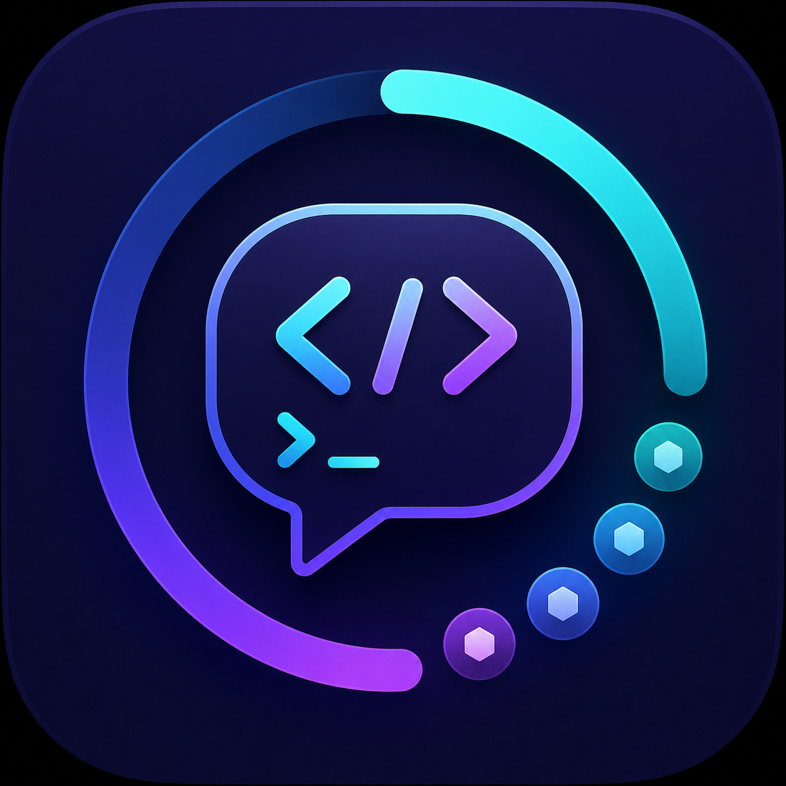

# Token Meter

<p align="center">
  
</p>

<p align="center">
  <strong>macOS menu bar app for monitoring Claude Code and Codex usage from one compact popover</strong>
</p>

<p align="center">
  
  
  
</p>

---

## What is Token Meter?

Token Meter lives in your macOS menu bar and shows coding-agent usage at a glance. It currently supports:

- **Claude Code**
  - Session usage (5-hour window)
  - Weekly usage (7-day window)
  - Per-project token breakdown
  - Reset countdown
- **Codex**
  - Current session usage from local Codex session snapshots when available
  - Availability/login-required fallback when no local session metric is available
  - Per-project token breakdown from local Codex artifacts

For Claude, Token Meter reads your Claude Code OAuth credentials and displays:

- **Session usage (5-hour window)** - Current usage percentage with color-coded gauge
- **Weekly usage (7-day window)** - Weekly consumption tracking
- **Per-project token breakdown** - See which projects consume the most tokens
- **Reset countdown** - Time remaining until your session limit resets

For Codex, Token Meter reads local Codex state on your Mac and shows project usage plus the current session usage or availability/login status.

## Screenshots

| Menu Bar | Usage View | Project Breakdown |
|----------|-----------|-------------------|
| Shows current session % | Color-coded usage gauges | Token usage per project |

## Installation

### Homebrew (Recommended)

```bash
brew install --cask younghyundev/tap/token-meter
```

### Troubleshooting: "App is damaged" error

If you see a "damaged" warning when opening the app, run:

```bash
xattr -cr /Applications/TokenMeter.app
```

This is because the app is not yet code-signed with an Apple Developer certificate. The Homebrew cask handles this automatically.

### Build from Source

Requires **Xcode 15+** and **macOS 14 (Sonoma)** or later.

```bash
git clone https://github.com/younghyundev/token-meter.git
cd token-meter
make install
```

This builds the app and copies it to `/Applications/TokenMeter.app`.

### Manual

Download the latest `.zip` from [Releases](https://github.com/younghyundev/token-meter/releases), extract, and drag `TokenMeter.app` to your Applications folder.

## Prerequisites

- **macOS 14.0 (Sonoma)** or later
- **Claude Code** must be installed and logged in if you want Claude usage
  - Token Meter reads Claude credentials from the Keychain entry or `~/.claude/.credentials.json`
- **Codex** must be installed and signed in locally if you want Codex usage
  - Token Meter reads Codex state from the current user's `~/.codex/auth.json` and `~/.codex/state_5.sqlite`

## Usage

1. Launch Token Meter - it appears as a Claude icon with a percentage in the menu bar
2. Click the icon to see detailed usage:
   - **Claude tab**: Session (5h), weekly (7d), and project breakdown
  - **Codex tab**: Current Codex session usage when available, otherwise availability/login state, plus project breakdown
   - **Projects**: Token breakdown by project (filterable by 1 day / 7 days / all time)
3. Click the gear icon to adjust settings:
   - **Language**: Korean / English
   - **Update interval**: 1min / 5min / 10min / 30min / 60min

## How It Works

Token Meter uses two data sources:

1. **Anthropic OAuth Usage API** - Fetches your Claude session and weekly utilization percentages using your Claude Code OAuth token
2. **Claude local JSONL logs** - Parses `~/.claude/projects/*/**.jsonl` files to calculate Claude project token usage
3. **Codex local session, auth, and SQLite state** - Reads `~/.codex/sessions/**/rollout-*.jsonl` for Codex session rate-limit snapshots, `~/.codex/auth.json` for fallback login state, and `~/.codex/state_5.sqlite` for project usage

The app automatically refreshes token data if the OAuth token expires, using the refresh token flow.

## Codex Limitations

- Codex session usage is shown when recent local `token_count` events exist in `~/.codex/sessions`.
- If no local session metric is available, Token Meter falls back to availability/login-required state instead of guessing a quota value.
- Codex project usage depends on local Codex activity already being present on this Mac and user account.
- Token Meter does not expose raw Codex auth tokens or local artifact contents in the UI.

## Configuration

| Setting | Default | Description |
|---------|---------|-------------|
| Language | Korean | UI language (Korean / English) |
| Update interval | 60 seconds | How often to fetch usage data |

Settings are persisted in UserDefaults.

## Troubleshooting

- **Claude tab says you are not logged in**
  - Sign in to Claude Code locally, then relaunch or refresh Token Meter.
- **Codex tab says login required**
  - Sign in to Codex locally for the current macOS user, then refresh Token Meter.
- **Codex tab shows unavailable**
  - Confirm Codex has been used on this Mac and that the current user has local Codex state under `~/.codex/`, then refresh.

## Uninstall

```bash
# If installed via Homebrew
brew uninstall --cask token-meter

# If installed via make
make uninstall

# Or manually
rm -rf /Applications/TokenMeter.app
```

## Tech Stack

- **Swift 5.9** / **SwiftUI**
- **macOS 14+** (MenuBarExtra API)
- Keychain Services for secure credential access
- No third-party dependencies

## Contributing

1. Fork the repository
2. Create your feature branch (`git checkout -b feature/amazing-feature`)
3. Commit your changes (`git commit -m 'feat: add amazing feature'`)
4. Push to the branch (`git push origin feature/amazing-feature`)
5. Open a Pull Request

## License

This project is licensed under the MIT License - see the [LICENSE](LICENSE) file for details.
